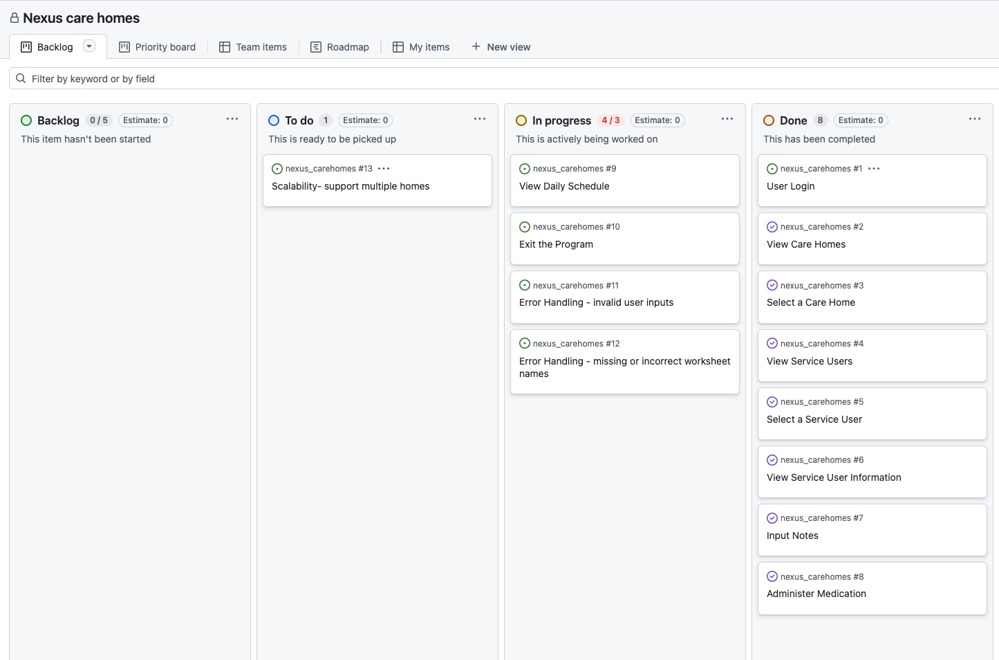

# [Nexus Carehomes](https://nexus-care-e0ddbf0b6681.herokuapp.com)

Developer: Bruce Chibisa ([Bruce0C](https://www.github.com/Bruce0C))

source: [nexus_carehomes amiresponsive](https://ui.dev/amiresponsive?url=https://nexus-care-e0ddbf0b6681.herokuapp.com)

## UX

**The 5 Planes of UX**

**1. Strategy**

**Purpose**
- Provide care givers simple and effective way to log service user activities and help with documentation.
- Help users optimize working day by reducing the amount of physical paperwork by using their devices to quiclkly take notes.
- Display information a care giver may find helpful about their working day.
- Add any input to a spreadsheet, this would aid manager and users of the google sheet to gain insite on the care givers and service users. 

**Primary User Needs**
- Log in/out.
- Choose assigned care home.
- View notes regarding service user.
- Input notes regarding service user
- Store notes in a worksheetsheet.
- Exit programme gracefully.

**Business Goals**
- Offer a reliable tool for care givers to optmise their knowladge of their service users.
- Help businesses reduce amount time needed to carry out a handover process.
- Reduce the amount of time it takes to write notes.
- Improve the legibility of notes.  
- Centralized data management
- Enhabce record keeping
- Simplify decision making
- Scalability by supporting multiple care homes and using goolge sheets as backend. 

**2. Scope**

**Features**
- User Login: Allow caregivers to log in and track their activities.
- Care Home Management:
  - View a list of care homes and their addresses.
  - Select a care home to view its service users.
- Service User Management:
  - View a list of service users in a selected care home.
  - Select a service user to view their details.
  - Add notes for a service user.
  - Administer medication to a service user with daily limits.
  - View the daily schedule for a service user.
- Error Handling:
  - Handle invalid inputs gracefully.
  - Provide clear error messages for missing or incorrect data.
- Data Storage:
  - Use Google Sheets for centralized data storage and retrieval.

**Content Requirements**

- Clear and concise instructions for users.
- Informative messages for each action (e.g., successful login, invalid input).
- Tabular data display for care homes, service users, and schedules.
- Color-coded messages for better readability (e.g., green for success, red for errors, yellow for warnings).

**3. Structure**

**Interaction Design**

- The application follows a linear flow:
  - User logs in.
  - User selects a care home.
  - User selects a service user.
  - User performs actions (e.g., input notes, administer medication, view schedule).
  - User exits the program.

**Information Architecture**

- The application is structured around the following key components:
  - Care Homes: Displays a list of care homes and allows the user to select one.
  - Service Users: Displays a list of service users for the selected care home.
  - Service User Information: Displays detailed information about the selected service user and provides options for further actions.
  - Notes and Medication: Allows users to input notes and administer medication.
  - Schedules: Displays the daily schedule for the selected service user.

4. Skeleton
Wireframe The application is a command-line interface (CLI), so the wireframe is represented by the flow of text-based menus and tables. Below is an example of the structure:...

Login Screen:
Care Home Selection:
Service User Selection:
Service User Information:
Daily Schedule:

**5. Surface**
**Visual Design**

- Color Scheme:
  - Green: Success messages (e.g., successful login, successful note addition).
  - Yellow: Warnings or prompts (e.g., menu options, input prompts).
  - Red: Error messages (e.g., invalid input, worksheet not found).
- Typography:
  - The application uses the default terminal font.
  - Text is formatted with Colorama for color and Tabulate for table formatting.
- User Feedback
 - The application provides immediate feedback for every action:
  - Success messages for completed actions.
- Error messages for invalid inputs or issues.
- Clear instructions for navigating menus and performing actions.
- Interaction Flow

- The user interacts with the application by entering numeric inputs to navigate menus and perform actions.
- The application uses a loop to ensure the user can retry if they make an invalid input.

| Target | Expectation | Outcome |
| --- | --- | --- |
| As a caregiver | I want to log in to the system | so that my activities can be tracked and recorded.. |
| As a caregiver  | I want to view a list of care homes | so that I can select the care home I am assigned to. |
| As a caregiver  | I want to select my assigned care home | so that I can view the service users in that care home. |
| As a caregiver  | I want to view a list of service users in my assigned care home | So that I can choose the service user I am responsible for.|
| As a caregiver  |I want to select a specific service user | so that I can view their details and manage their information. |
| As a caregiver  | I want to view detailed information about a service user | so that I can better understand their needs and provide appropriate care.|
| As a caregiver  | I want to input notes about a service user | so that I can document important information about their care. |
| As a caregiver | I want to log the medication I administer to a service user | so that I can track the medication history and ensure compliance with dosage limits. 
| As a caregiver| I want to view the daily schedule for a service user | so that I can plan my day and ensure all activities are completed on time. 
| As a caregiver | I want to exit the program gracefully | so that I can end my session without losing any data. 
| As a caregiver | I want the program to handle invalid inputs | so that I can correct my mistakes without the program crashing. 
| As a manager | I want all data to be stored in a centralized Google Sheet | so that I can monitor and analyze the activities of caregivers and service users. 
| As a business owner | I want the system to support multiple care homes and service users | so that it can scale as my business grows. 
| As a caregiver | I want the application to be simple and easy to use | so that I can quickly navigate and perform my tasks without confusion. |

## Features

| Features | Notes| Screenshots |
| --- | --- | --- |
|User Login| Users can log in by entering their name, which is stored in the user worksheet. | [screenshot](documentation/features/data-validation.png)|
|Care Home Management| View a list of care homes and their addresses. | [screenshot](documentation/features/data-validation.png)|
| |Select a care home to view its service users. | [screenshot](documentation/features/data-validation.png)|
|Service User Management: | View a list of service users in a selected care home. | [screenshot](documentation/features/data-validation.png) |
| | Select a service user to view their information. | [screenshot](documentation/features/data-validation.png)|
| | Add notes for a service user. | [screenshot](documentation/features/data-validation.png) |
| | Administer medication to a service user with daily limits. | [screenshot](documentation/features/data-validation.png)|
| | View the daily schedule for a service user. | [screenshot](documentation/features/data-validation.png)|
|Interactive Menus: | Navigate through the application using numbered options. | [screenshot](documentation/features/data-validation.png)|
|Error Handling: | Handles invalid inputs and provides user-friendly error messages. | [screenshot](documentation/features/data-validation.png)|
|Data Storage: | Uses Google Sheets as the backend for storing and retrieving data. | [screenshot](documentation/features/data-validation.png) |

**Future Features**
- **User Authentication**: Add a login system with usernames and passwords for caregivers to ensure secure access to the application.
- **Role-Based Access Control**: Implement different user roles (e.g., caregiver, manager, admin) with varying levels of access.
- **Reporting and Analytics**: Generate reports and analytics for managers, such as:
   - Total notes added per caregiver.
   - Medication logs for each service user.
   - Summary of daily activities.
- **Notifications and Reminders**: Add notifications and reminders for caregivers about upcoming tasks, medication schedules, or important notes.
- **Search and Filter Functionality**: Allow users to search for specific service users, notes, or care homes and filter data based on criteria (e.g., age, room number, or activity type).
- **Export Data**: Allow users to export data (e.g., notes, schedules, or reports) to CSV or PDF files for offline use or sharing.
- **Customizable Schedules**: Allow caregivers or managers to customize the daily schedules for service users.
- **Service User Alerts**:
Description: Add alerts for critical service user conditions (e.g., missed medication, overdue tasks).

## Tools & Technologies

| Tool / Tech | Use |
| --- | --- |
|  | Generate README and TESTING templates. |
|  | Version control. (`git add`, `git commit`, `git push`) |
|  | Secure online code storage. |
|  | Back-end programming language. |
|  | Hosting the deployed back-end site. |
|  | Flow diagrams for mapping the app's logic.|
 | Used for data storage and retrieval.|
|[Colorama](https://pypi.org/project/colorama/)| For adding colors to the terminal output.|
|[Tabulate](https://pypi.org/project/tabulate/)| For displaying data in a tabular format in the terminal.|

## Database Design

### Data Model

#### Flowchart

To follow best practice, a flowchart was created for the app's logic, and mapped out using a free version of [Lucidchart](https://www.lucidchart.com/pages/landing?utm_source=google&utm_medium=cpc&utm_campaign=_chart_en_tier1_mixed_search_brand_exact_&km_CPC_CampaignId=1490375427&km_CPC_AdGroupID=55688909257&km_CPC_Keyword=lucid%20chart&km_CPC_MatchType=e&km_CPC_ExtensionID=&km_CPC_Network=g&km_CPC_AdPosition=&km_CPC_Creative=442433236001&km_CPC_TargetID=kwd-55720648523&km_CPC_Country=9207727&km_CPC_Device=c&km_CPC_placement=&km_CPC_target=&gad_source=1&gad_campaignid=1490375427&gbraid=0AAAAADLdSjCZdVLtLZlGkXsJxpLxrrH5v&gclid=Cj0KCQiAkPzLBhD4ARIsAGfah8gYdAgpF23HWd-02e0-2pXGsdTNgShyvfqkr9xda1MTZY-jis3vvhoaAsZhEALw_wcB). The flowchart below represents the main process of this Python program. It shows the entire cycle of the application.

'''mermaid
flowchart TD
    A[Start] --> B[Log User Login]
    B -->|Valid Name| C[Display Care Homes]
    B -->|Invalid Name| B

    C --> D[Select Care Home]
    D -->|Valid Input| E[Display Service Users]
    D -->|Exit| Z[Exit Program]
    D -->|Invalid Input| D

    E --> F[Select Service User]
    F -->|Valid Input| G[Display Service User Information]
    F -->|Return to Care Homes| C
    F -->|Invalid Input| F

    G -->|Data Available| H[Display Options]
    G -->|No Data Available| H

    H -->|Input Notes| I[Input Notes]
    H -->|Administer Medication| J[Administer Medication]
    H -->|View Daily Schedule| K[View Daily Schedule]
    H -->|Exit| Z

    I -->|Note Added Successfully| H
    I -->|Error Adding Note| I

    J -->|Valid Input| J1[Check Daily Limit]
    J -->|Invalid Input| J
    J1 -->|Limit Reached| H
    J1 -->|Medication Administered| H

    K -->|Data Available| H
    K -->|No Data Available| H

    Z[Exit Program]

Source: [Mermaid Flowchart for Nexus care homes ](https://mermaid.live/edit#pako:eNp9VNFyojAU_ZVMnm1HalHhYWcUtGpbd6fu9qHgQ5ZcNbOQOCHYuuq_b4igoM7yAuGcc8-59zLscCQoYBcvYvEZrYhU6KcfcqSvXjBT-jxHd3ffUD94EUv0KwWJ9APj8yOnn4P7dxIziqYkgT3yAp-l65hskUckoJFIIK2Rx3xTofdDfgQ9Y-MHM4ghUmdxofUrRmO-ztQeDU5OM5AbFoGJl9YEgy-mmR9Bfkc_pFhKktQIZZqipl_GGZg4wzJO1aHQD68TPd1MpNGFkAlRTPCa9g1UJjlSojIqPcAq5SLesIz3ZFCfKIJ6G8Ji8jvWwxyd_L-vc7dyFkf2VKArQVlvVLhpFzQVKs8xDirHeZXWownjLFW6tVegLDKd7dEkuAnUpO8MPnUKFusRRSugWZ7iObjxuiYr1limHRf9KEA9SoGiWRZFkKaLLI63pqszayClkDmN8aXpRXdW1plcr3BiBd4Koj9FmheWMDWvsi82Mikwy4CGjt6A5E2cghTgeSToPKiCdiQ-395qFfzfEi8-c9zAS8kodpXMoIET0N9gfsS7nB5itYIEQuzqRwoLksUqxCE_aNma8A8hklIpRbZcYXdB4lSfsjUlCnxGcpMTBTgF6YmMK-zapgJ2d_gLu1373mlZbdt5dFqtZsdxGnir39471kPL6rZbjw-21W52Dg3811g2NdK1HLvZdDTBbnd0NT04JeTr8Udl_leHf6GMf4c)

#### Functions

- `log_user_login()`
  - Purpose: Logs the caregiver's name and stores it in the user worksheet.

- `update_user_worksheet(name_str)`
  - Purpose: Updates the user worksheet with the caregiver's name.

- `get_care_homes()`
  - Purpose: Fetches and displays a list of care homes and their addresses.

- `select_home()`
  - Purpose: Allows the user to select a care home from the displayed list.

- `select_service_user(selected_home)`
  - Purpose: Displays service users for the selected care home and allows the user to select one.

- `service_user_information(selected_user)`
  - Purpose: Fetches and displays data for the selected service user and provides options for further actions.

- `view_daily_schedule(schedule_worksheet, selected_user)`
  - Purpose: Fetches and displays the daily schedule for the selected service user.

- `administer_medication(selected_user)`
  - Purpose: Allows the caregiver to administer medication to the selected service user.

- `main()`
  - Purpose: Orchestrates the execution of all program functions.

#### Imports

I've used the following Python packages and external imports.

- `gspread`: used with the Google Sheets API
- `google.oauth2.service_account`: used for the Google Sheets API credentials
- `time`: used for adding time delays
- `os`: used for adding a `clear()` function
- `colorama`: used for including color in the terminal
- `tabulate`: used to display table in terminal 

## Agile Development Process

### GitHub Projects

[GitHub Projects](https://www.github.com/Bruce0C/nexus_carehomes/projects) served as an Agile tool for this project. Through it, EPICs, User Stories, issues/bugs, and Milestone tasks were planned, then subsequently tracked on a regular basis using the Kanban project board.

### MoSCoW Prioritization

I've decomposed my Epics into User Stories for prioritizing and implementing them. Using this approach, I was able to apply "MoSCoW" prioritization and labels to my User Stories within the Issues tab.

- **Must Have**: guaranteed to be delivered - required to Pass the project (*max ~60% of stories*)
- **Should Have**: adds significant value, but not vital (*~20% of stories*)
- **Could Have**: has small impact if left out (*the rest ~20% of stories*)
- **Won't Have**: not a priority for this iteration - future features

## Testing

> [!NOTE]  
> For all testing, please refer to the [TESTING.md](TESTING.md) file.

## Deployment

Code Institute has provided a [template](https://github.com/Code-Institute-Org/python-essentials-template) to display the terminal view of this backend application in a modern web browser. This is to improve the accessibility of the project to others.

The live deployed application can be found deployed on [Heroku](https://nexus-care-e0ddbf0b6681.herokuapp.com).

### Heroku Deployment

This project uses [Heroku](https://www.heroku.com), a platform as a service (PaaS) that enables developers to build, run, and operate applications entirely in the cloud.

Deployment steps are as follows, after account setup:

- Select **New** in the top-right corner of your Heroku Dashboard, and select **Create new app** from the dropdown menu.
- Your app name must be unique, and then choose a region closest to you (EU or USA), then finally, click **Create App**.
- From the new app **Settings**, click **Reveal Config Vars**, and set the value of **KEY** to `PORT`, and the **VALUE** to `8000` then select **ADD**.
- If using any confidential credentials, such as **CREDS.JSON**, then these should be pasted in the Config Variables as well.
- Further down, to support dependencies, select **Add Buildpack**.
- The order of the buildpacks is important; select `Python` first, then `Node.js` second. (if they are not in this order, you can drag them to rearrange them)

Heroku needs some additional files in order to deploy properly.

- [requirements.txt](requirements.txt)
- [Procfile](Procfile)
- [.python-version](.python-version)

You can install this project's **[requirements.txt](requirements.txt)** (*where applicable*) using:

- `pip3 install -r requirements.txt`

If you have your own packages that have been installed, then the requirements file needs updated using:

- `pip3 freeze --local > requirements.txt`

The **[Procfile](Procfile)** can be created with the following command:

- `echo web: node index.js > Procfile`

The **[.python-version](.python-version)** file tells Heroku the specific version of Python to use when running your application.

- `3.12` (or similar)

For Heroku deployment, follow these steps to connect your own GitHub repository to the newly created app:

Either (*recommended*):

- Select **Automatic Deployment** from the Heroku app.

Or:

- In the Terminal/CLI, connect to Heroku using this command: `heroku login -i`
- Set the remote for Heroku: `heroku git:remote -a app_name` (*replace `app_name` with your app name*)
- After performing the standard Git `add`, `commit`, and `push` to GitHub, you can now type:
	- `git push heroku main`

The Python terminal window should now be connected and deployed to Heroku!

