# Testing

> [!NOTE]  
> Return back to the [README.md](README.md) file.

## Code Validation

| Directory | File | URL | Screenshot | 
| --- | --- | --- | --- | 
|  | [run.py](https://github.com/Bruce0C/nexus_carehomes/blob/main/run.py) | [PEP8 CI Link](https://pep8ci.herokuapp.com/https://raw.githubusercontent.com/Bruce0C/nexus_carehomes/main/run.py) |  | 

## Defensive Programming
| Test Case | Feature | Expected Behaviour | Test Steps | Result | Fix | Screenshot
|----------|--------|-------------------|-----------|--------|-----|----|
| 1 | Validate user input for menu options in `select_home()` | Valid inputs (1, 2, 3, 0) navigate correctly. Invalid or non-numeric inputs show an error and re-prompt the user. | • Entered valid inputs (1, 2, 3, 0)   • Entered invalid inputs (4, -1, 100)   • Entered non-numeric inputs ("abc", "!@#", blank) | • Valid inputs navigated correctly or exited   • Invalid and non-numeric inputs displayed an error and re-prompted | No fixes required | 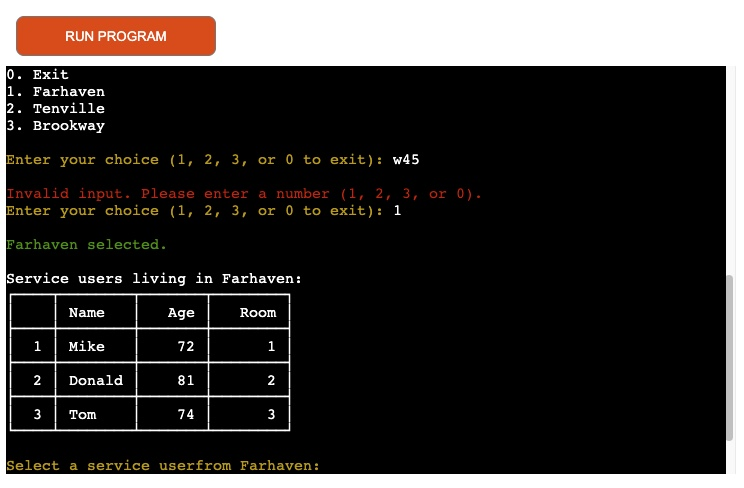 |
| 2 | Handle missing or incorrect worksheet names in `service_user_information()` | If the worksheet does not exist, an error message is shown and the user can return to the previous menu. | • Tested with valid worksheet name ("farhaven")   • Tested with invalid worksheet name ("invalid_user")   • Tested with deleted worksheet | • Valid worksheet fetched and displayed correctly   • Invalid/missing worksheet displayed appropriate error message | No fixes required | 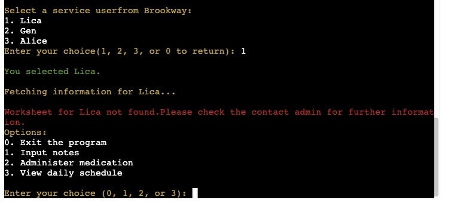 |
| 3 | Enforce daily medication limits in `administer_medication()` | Maximum of 2 pills per type per day. Exceeding the limit shows a warning and prevents logging. | • Administered 1 red and 1 blue pill   • Attempted third red pill   • Attempted third blue pill | • First two pills administered successfully   • Third pill attempts blocked with warning message | No fixes required | 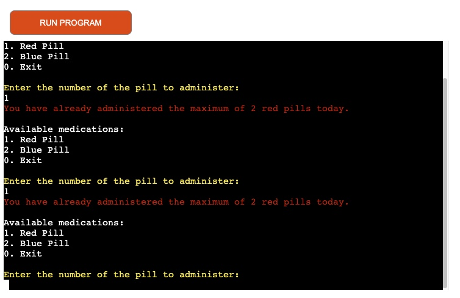 |
| 4 | Graceful program exit in `select_home()` and `service_user_information()` | Selecting "Exit" displays a goodbye message and terminates the program gracefully. | • Selected Exit from care home menu   • Selected Exit from service user menu | Program displayed exit message and terminated without errors | No fixes required | 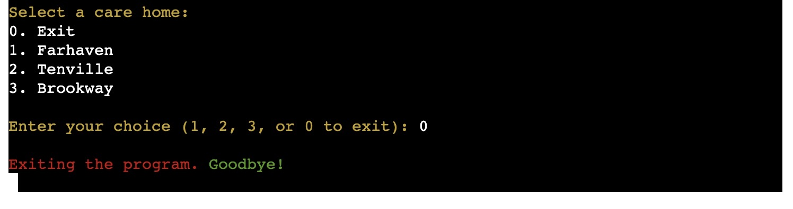 |
| 5 | Handle invalid menu choices in `select_home()` and `select_service_user()` | Invalid or non-numeric menu choices display an error message and re-prompt the user. | • Entered valid inputs (1, 2, 3, 0)   • Entered invalid inputs (4, -1, 100)   • Entered non-numeric inputs ("abc", "!@#", blank) | • Valid inputs navigated correctly   • Invalid inputs showed appropriate error messages and re-prompted | No fixes required | 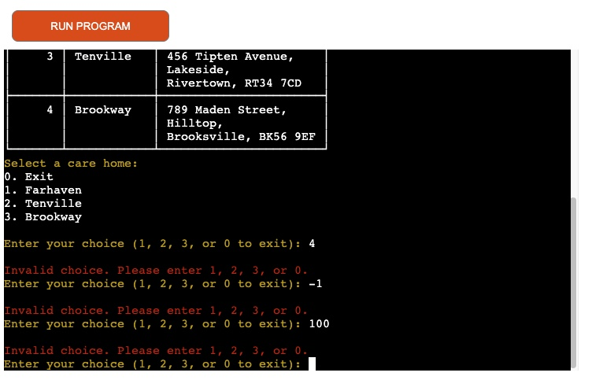 |

## User Story Testing

| Target | Expectation | Outcome | Screenshot |
| --- | --- | --- | --- |
| As a caregiver | I want to log my username to the system | so that my activities can be tracked and recorded. |  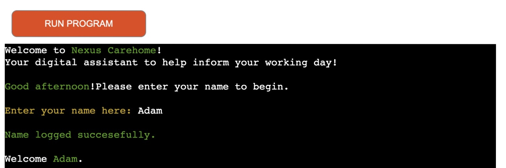 |
| As a caregiver  | I want to view a list of care homes | so that I can select the care home I am assigned to. |  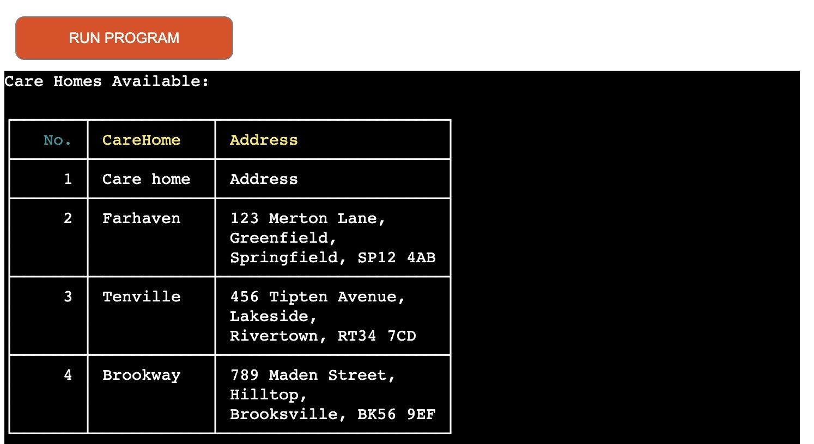 |
| As a caregiver  | I want to select my assigned care home | so that I can view the service users in that care home. |  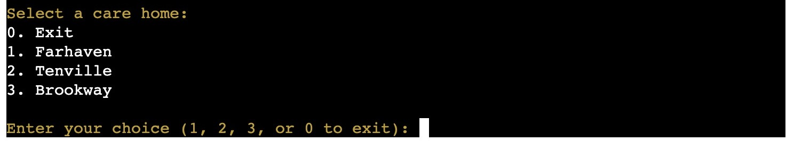 |
| As a caregiver  | I want to view a list of service users in my assigned care home | So that I can choose the service user I am responsible for.|   |
| As a caregiver  | I want to select a specific service user | so that I can view their details and manage their information. |   |
| As a caregiver  | I want to view detailed information about a service user | so that I can better understand their needs and provide appropriate care.|   |
| As a caregiver  | I want to input notes about a service user | so that I can document important information about their care. |  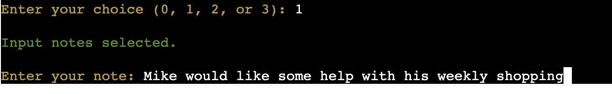 |
| As a caregiver | I want to log the medication I administer to a service user | so that I can track the medication history and ensure compliance with dosage limits. |  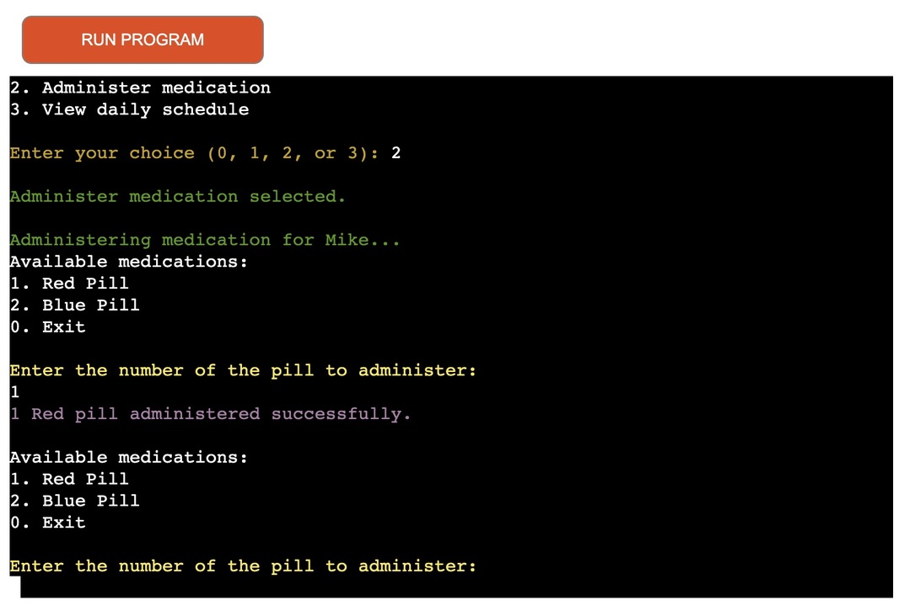 |
| As a caregiver| I want to view the daily schedule for a service user | so that I can plan my day and ensure all activities are completed on time. |  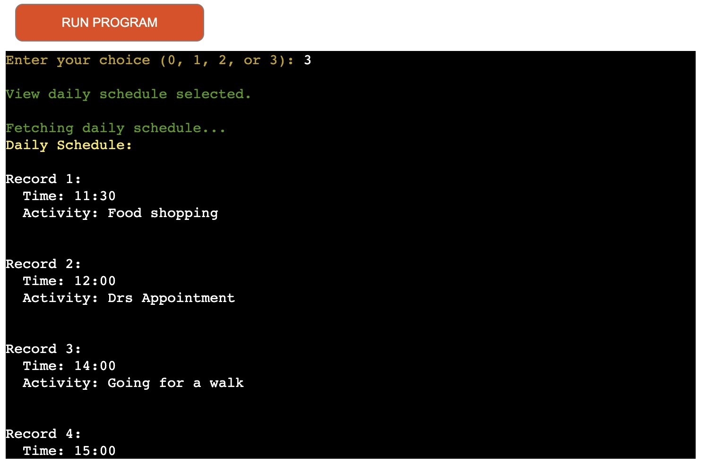 |
| As a caregiver | I want to exit the program gracefully | so that I can end my session without losing any data. |   |
| As a caregiver | I want the program to handle invalid inputs | so that I can correct my mistakes without the program crashing. |   |
| As a manager | I want all data to be stored in a centralized Google Sheet | so that I can monitor and analyze the activities of caregivers and service users. |  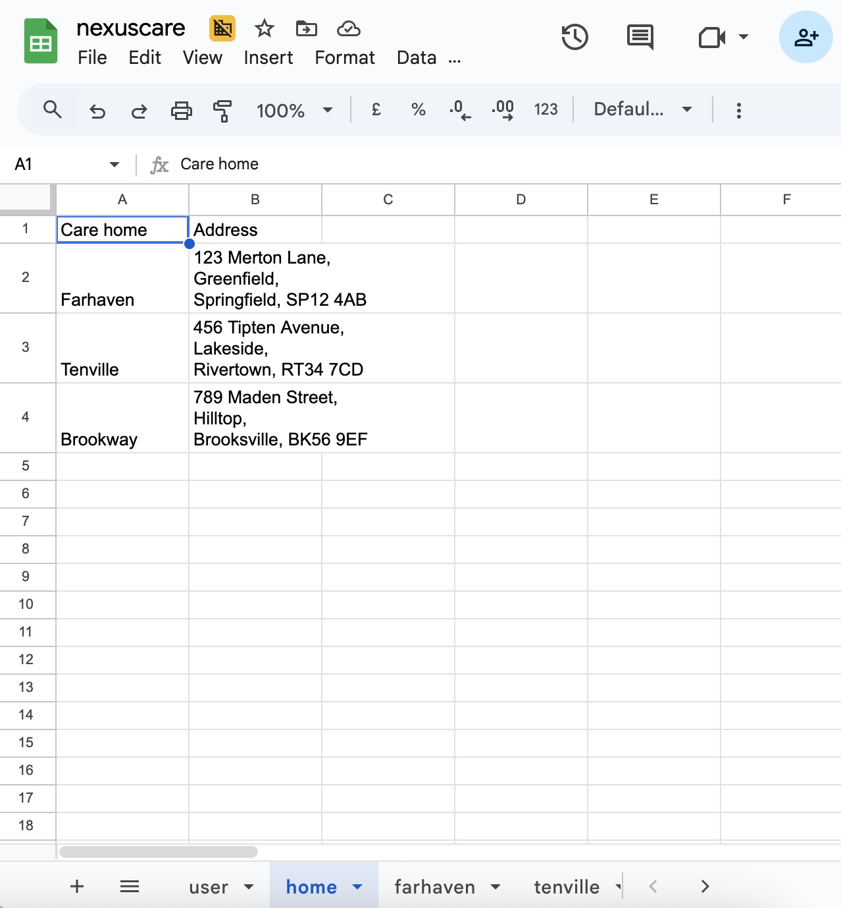 |
| As a business owner | I want the system to support multiple care homes and service users | so that it can scale as my business grows. |   |
| As a caregiver | I want the application to be simple and easy to use | so that I can quickly navigate and perform my tasks without confusion. |  |

## Bugs

### Fixed Bugs

|  Bug |  Fix | Screenshot|
| ---| ---| --| 
|Notes Input Created Blank Rows in Service User Worksheets. When caregivers attempted to input notes for a specific service user, the program appended the notes directly to the worksheet corresponding to the service user's name. However, this caused an issue where only the notes were added as a new row, leaving the rest of the row blank. This created confusion for users, as the service user worksheets were intended to store structured data (e.g., name, age, room number, etc.), and the blank rows disrupted the layout and organization of the data. This negatively impacted the user experience and made it difficult to manage the service user data effectively.| Created a Separate notes Worksheet  To resolve this issue, a dedicated notes worksheet was created to store all notes separately from the service user worksheets. This ensures that notes are stored in a centralized location, making it easier for caregivers and managers to review them. The service user worksheets remain clean and organized, containing only structured data relevant to the service users. The user experience is improved, as caregivers can now easily input and retrieve notes without disrupting the service user data.|  |

I've used [GitHub Issues](https://www.github.com/Bruce0C/nexus_carehomes/issues) to track and manage bugs and issues during the development stages of my project.

All previously closed/fixed bugs can be tracked [here](https://www.github.com/Bruce0C/nexus_carehomes/issues?q=is%3Aissue+is%3Aclosed+label%3Abug).

### Known Issues

| Issue | Screenshot |
| --- | --- |
| The project is designed to be responsive from `375px` and upwards, in line with the material taught on the course LMS. Minor layout inconsistencies may occur on extra-wide (e.g. 4k/8k monitors), or smart-display devices (e.g. Nest Hub, Smart Watches, Gameboy Color, etc.), as these resolutions are outside the project’s scope, as taught by Code Institute. |  |
| When using a helper `clear()` function, any text above the height of the terminal (24 lines) does not clear, and remains when scrolling up. |  |
| The `colorama` terminal colors are fainter on Heroku when compared to the IDE locally. |  |
| Emojis are cut-off when viewing the application from Firefox. |  |
| The Python terminal doesn't work well with Safari, and sometimes uses cannot type in the application. |  |
| If a user types `CTRL`+`C` in the terminal on the live site, they can manually stop the application and receive and error. |  |

> [!IMPORTANT]  
> There are no remaining bugs that I am aware of, though, even after thorough testing, I cannot rule out the possibility.

