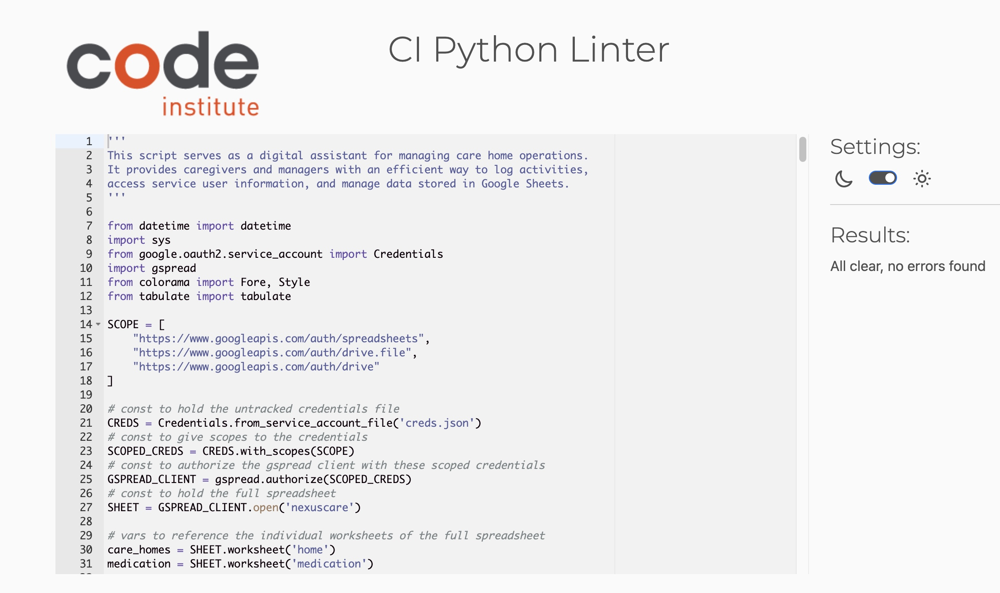

# Testing

> [!NOTE]  
> Return back to the [README.md](README.md) file.

## Code Validation

| Directory | File | URL | Screenshot | 
| --- | --- | --- | --- | 
|  | [run.py](https://github.com/Bruce0C/nexus_carehomes/blob/main/run.py) | [PEP8 CI Link](https://pep8ci.herokuapp.com/https://raw.githubusercontent.com/Bruce0C/nexus_carehomes/main/run.py) |  | 

## Defensive Programming

 ### Invalid User Inputs

- Feature: Validate user input for menu options in select_home()

**Expected:**
When the user enters a valid number (1, 2, 3, or 0), the program should proceed to the corresponding care home or exit the program.
If the user enters an invalid number or a non-numeric value, the program should display an error message and prompt the user again.

**Testing:** 
- Entered valid inputs (1, 2, 3, 0).
- Entered invalid inputs (e.g., 4, -1, 100).
- Entered non-numeric inputs (e.g., "abc", "!@#", or left the input blank).

**Result:**
- Valid inputs: The program correctly navigated to the selected care home or exited the program.
- Invalid inputs: The program displayed an error message and prompted the user again.
- Non-numeric inputs: The program displayed an error message and prompted the user again.
- Fix: No fixes were required as the feature behaved as expected.

 ### Missing or Incorrect Worksheet Names

**Feature:** Handle missing or incorrect worksheet names in service_user_information()

**Expected:**
If the worksheet for the selected service user does not exist, the program should display an error message and allow the user to return to the previous menu.

**Testing:**
Tested with a valid worksheet name (e.g., "farhaven").
Tested with an invalid worksheet name (e.g., "invalid_user").
Tested with a missing worksheet (e.g., deleted the worksheet from Google Sheets).

**Result:**
Valid worksheet name: The program successfully fetched and displayed the data.
Invalid or missing worksheet name: The program displayed the error message:
"Worksheet for [selected_user] not found. Please contact admin for further information."

**Fix:**
No fixes were required as the feature behaved as expected.

## User Story Testing

## Bugs

### Fixed Bugs

### Unfixed Bugs

### Known Issues

> [!IMPORTANT]  
> There are no remaining bugs that I am aware of, though, even after thorough testing, I cannot rule out the possibility.

